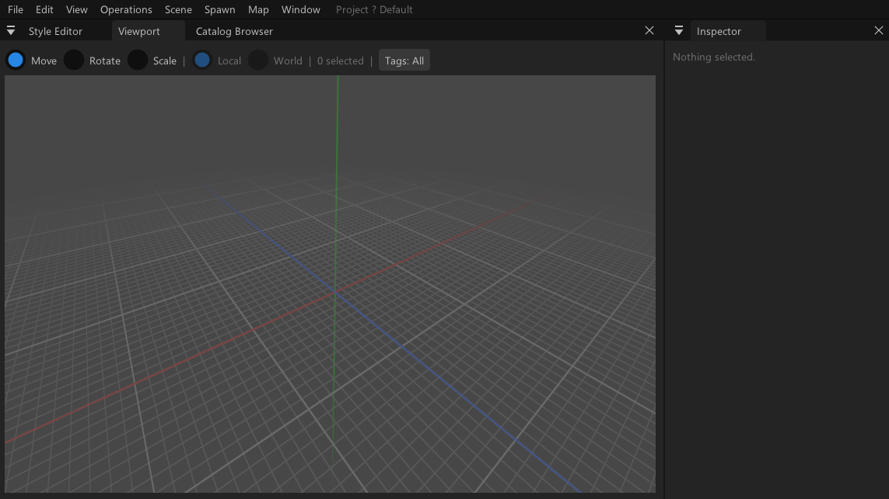

# WorldMapStudio



WorldMapStudio is a procedural, non-destructive map editor built on Godot 4 with C#.

## Requirements

- [Godot 4.7](https://godotengine.org/download) with .NET/C# support (the `godot` binary on your `PATH`, referred to below as `godot`; on some installs it may be `godot-mono`)
- [.NET SDK 8.0](https://dotnet.microsoft.com/download)

## Installation

Clone the repository:

```sh
git clone <repo-url>
cd WorldMapStudio
```

Restore and build the C# project:

```sh
dotnet build
```

Import assets and open the project in the Godot editor:

```sh
godot --headless --import --quit-after 1000
godot .
```

## Building

Build the managed assembly (add `-p:Optimized=true` for an optimized build):

```sh
dotnet build
dotnet build -p:Optimized=true
```

Re-import assets after a build (required before running headless or exporting):

```sh
godot --headless --import --quit-after 1000
```